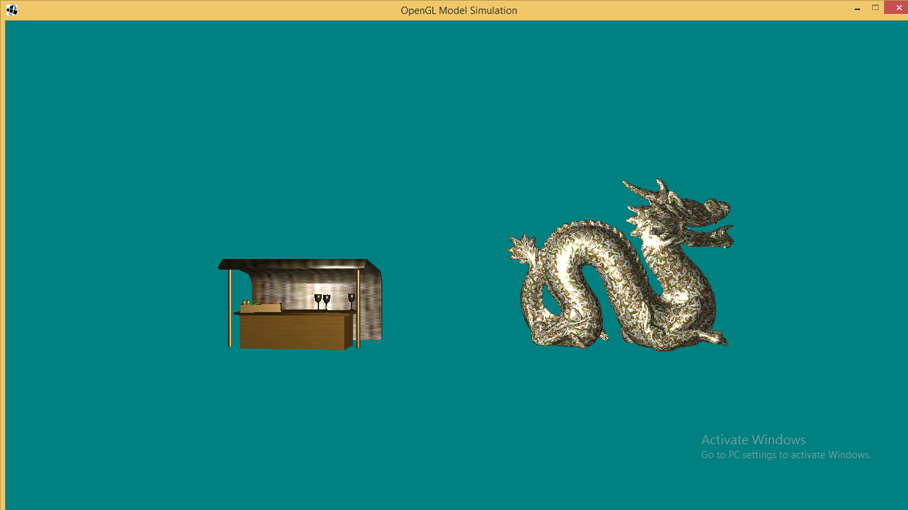
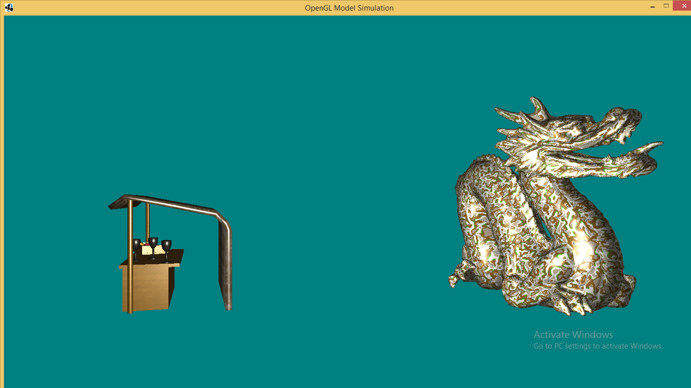
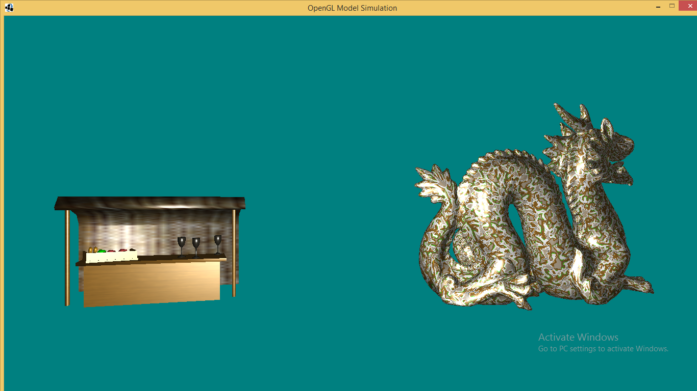

## Overview
The project can load any 3-D model made in Blender or any other 3-D modeling software and also allows you to wrap it in any texture of your choice, it also supports an open world simulation with a 3-D camera system and all lightnig effects(diffuse, specular, ambient) with single or multipe light sources. It has a OOP design with the following packages-

* Models
* Entity
* Loader
* Shader
* Renderer
* Camrea
* ToolBox

## Models
The purpose of the model package is to wrap the object provided by the blender software into VAO which can later be rendered by the the GPU through the Renderer package. It has the following classes-
```
* RawModel : The lowermost level of the wrapper and stores only the VAO Id for the given object.
* TextureModel : Stores the Id of the texture image.
* TexturedModel : Combination of the above two classes, store the model with position and texture.
* Entity : The highest level of abstraction, store the complete model with its position, texture and rotation.
```

## Entity
Stores the classes to instanciate all the entities present in our 3-D space, as of now it only stores the following -
```
* Light : Store the representation of the LightSources in our 3-D space.
```

## Loader
Loder packages has classes with static methods to load various objects/textures/VAO in our program
```
* VAOLoader : Loads the Entity data int Vertex array Objects(VAO) for rendering.
* TextureLoader : Loads the texture provided by the program into the VAO.
* OBJLoader : Loads up the model provided by the user into the VAO.
```

## Shader
Has all the classes related to shaders(vertex + fragment).
```
ShaderProgram : The innermost layer of abstraction which is extended by all types of shader, has all the essential functions for shaders.
StaticShader : Shader program which will not change later in the porgram.
VertexShader : The actual code of vertexShader.
FragmentShader : The actual code for FragMent Shader.
```

## Renderer
Has all the classes required to render our object to the screen using the OpenGL libraries
```
DisplayManager : Manages the current Display Mode eg (FPS, Width, Height, refresh).
Renderer : The innermost abstraction of the renderer.
MasterRenderer : The outermost abstracion layer to render all diffrent types of entities.
```

### Camera
Store the classes defining the camera representation for our 3-D space
```
Camera : Has the position, orientation of the camera.
```

## ToolBox
Store all the maths classes/function that we will be requireing in our program frequently
```
ToolBox : Stores method to create (transformation, projection, view) Matrix for our 3-D space and camera.
```

## Screenshots
Here are some of the screenshots of the project with a random stall model made in Blender and the Standford Dragon model. Both of them have a random texture attached to them.



